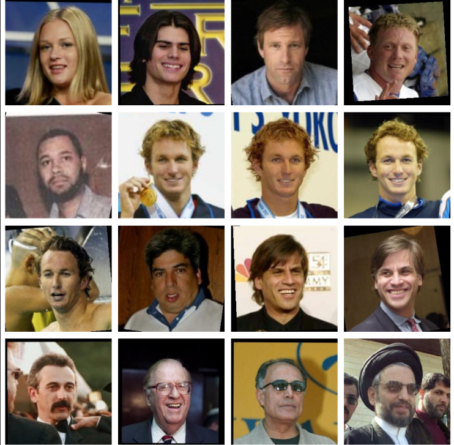
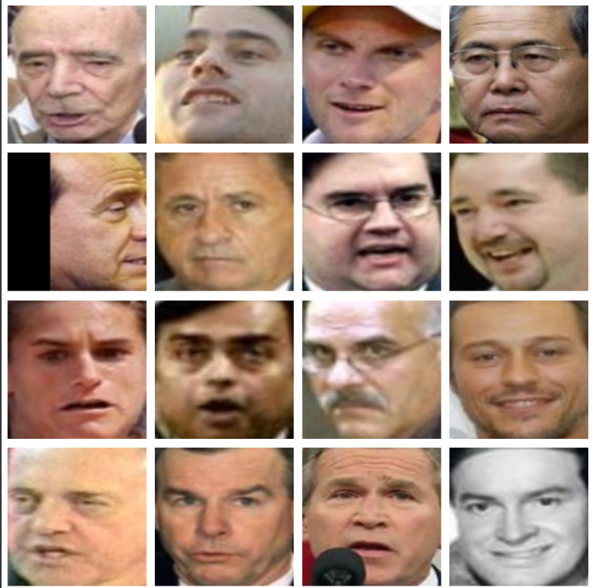
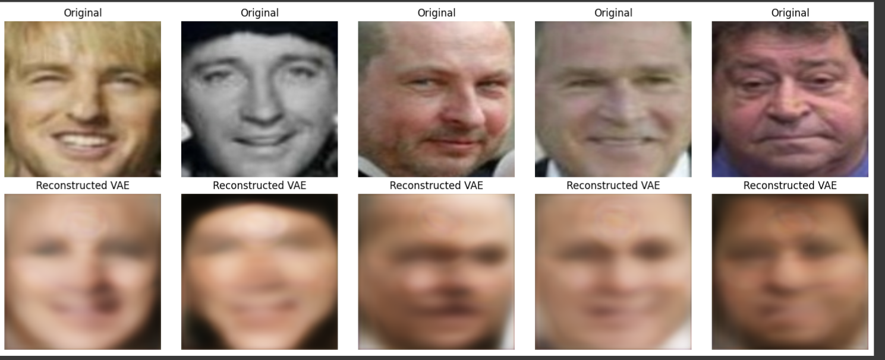
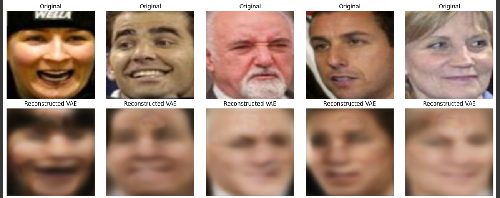
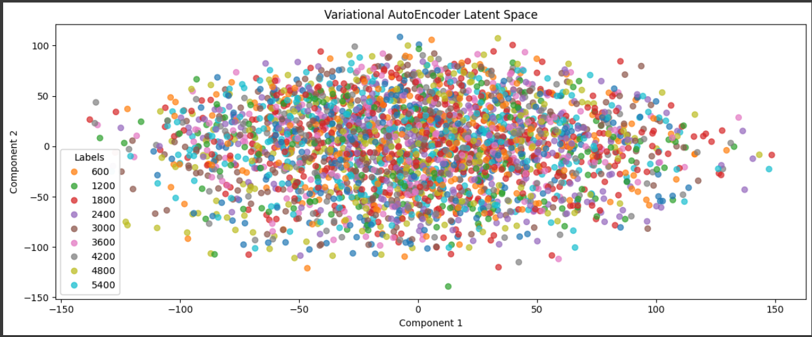
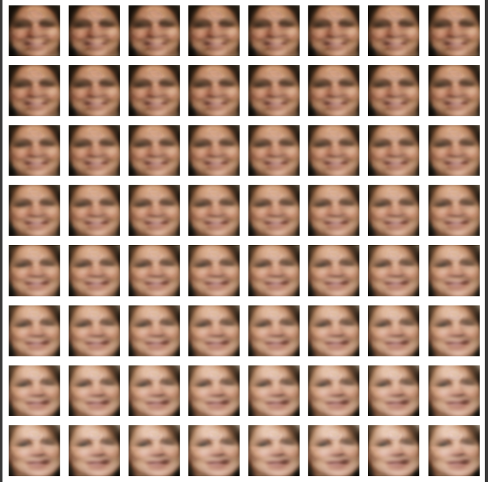
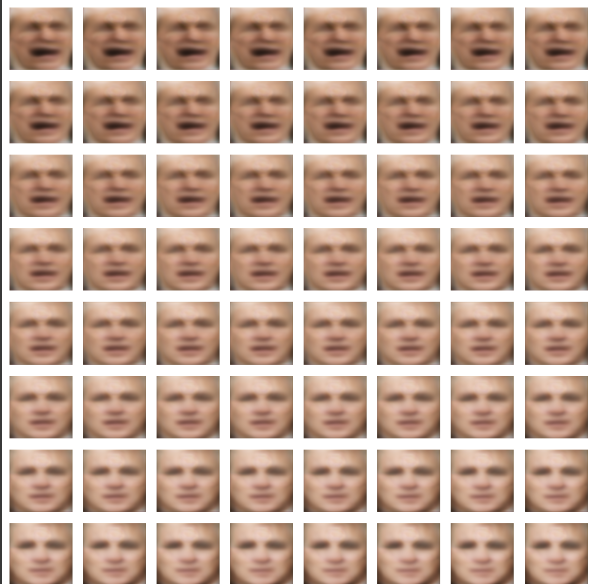
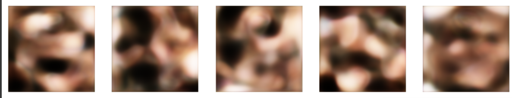
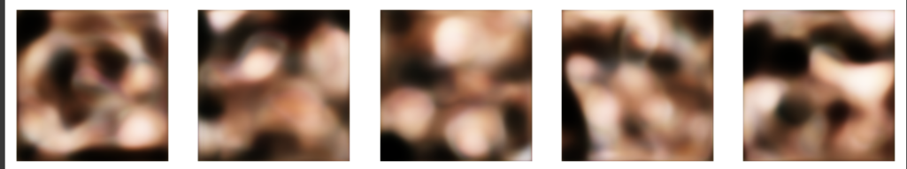
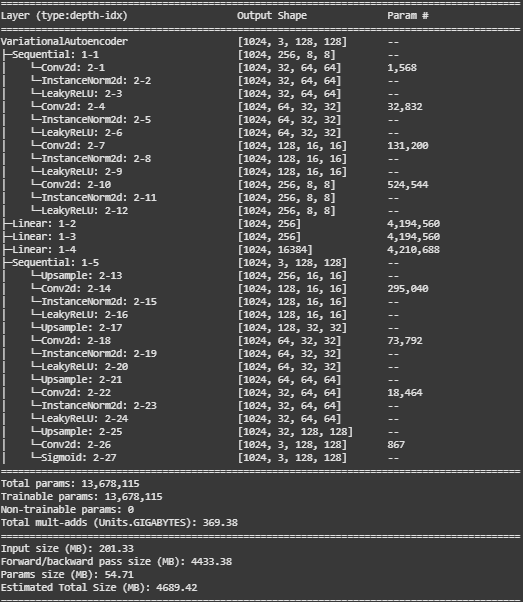

# Face-Generation-Using-AutoEncoders-and-Variational-AutoEncoders
Implemented Face Generation Using AE and VAE on LFW Dataset

## Original Images form LFW Dataset

## MTCNN Cropped Images

## Generated images by Variational AutoEncoder comparision with Original MTCNN Cropped images

## Latent Space Visualization by PCA in 2D

## Interpolation of 2 images sampled from Latent Space

## Sampling from Latent Space and Generating through Decoder

## Variational AutoEncoder Model

